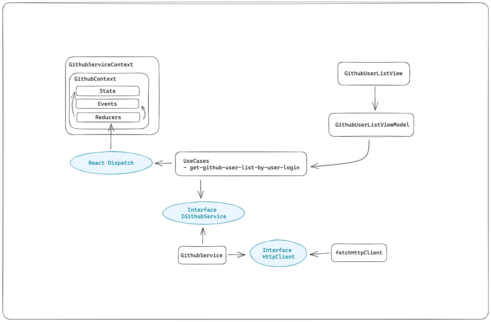

# Github User Search | Fulll

## Subject

[Github User Search Intermediate Senior - Fulll Hiring ](https://github.com/fulll/hiring/blob/master/Frontend/github-user-search-intermediaire-senior.md)

## Installation

```bash
# NPM
npm install
npm run dev

# PNPM
pnpm install
pnpm run dev
```

## Documentation

### Architecture Explanation

---



I have decided to follow some principles of the Clean Architecture. The goal of the Clean Architecture is to isolate the domain and avoid dependencies between the differents parts. This allow a better testability and modularity.

I have followed a MVVM Pattern to render the component dumb as possible, with no logic business.

As we weren't allowed to use any dependencies other than testing libraries, i have decided to use React Context like a State Management.

I also used an approach of programming oriented events.

Even if it's a Clean Architecture, i have decided to coupling my use cases to React Context. Not coupling the domain to Redux or any other State Management whould have added a lot of wrapper to avoid dependencies.

I only had added the dependency `path` to use an alias on the project to improve the readibility of file paths.

## Testing

```bash
# NPM
npm run test

# PNPM
pnpm run test
```

### Libraries

- vitest
- @testing-library/react
